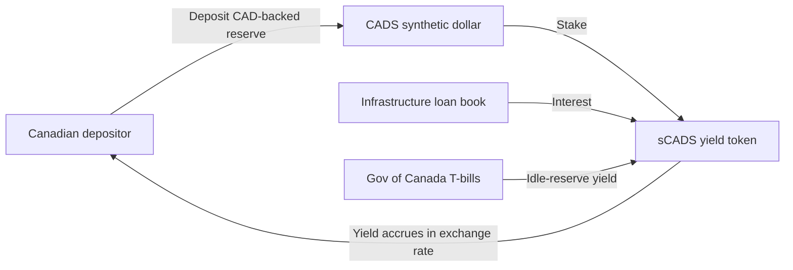
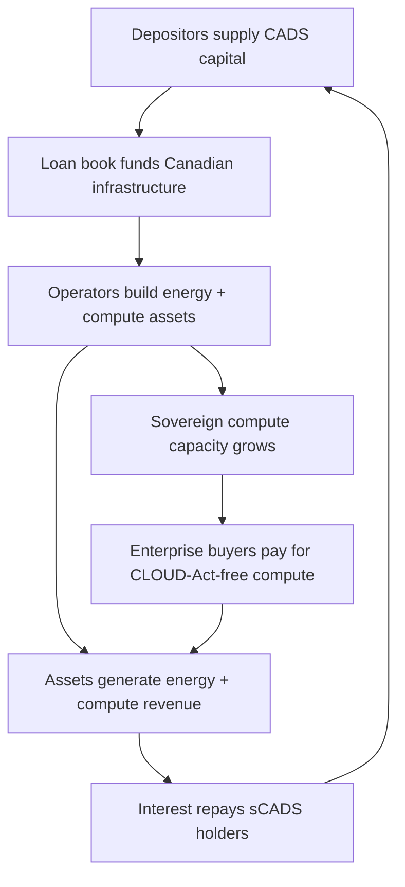

> MIRRORED from the Perceptiosphere vault (`04_Execute/DAICompute/brand/brand-guidelines/`), the source of truth. Copied into this repo so AI agents working here (Cursor) have the brand context without the vault. If this conflicts with the vault, the vault wins - flag it. Synced 2026-07-26.

# DAI Compute - Tokenomics (Sovereign InfraFi Model)

> A ground-up reconsideration of the token system, modelled on USD.AI's two-sided InfraFi credit protocol and adapted to Canadian sovereign energy and compute infrastructure. This **supersedes** the earlier NRG + CMP dual-token utility design in `indicators-strategy/strategy.md`. NRG and CMP are retired as headline tokens; their mint-on-generation / mint-on-provision functions survive only as the asset-attestation layer beneath the credit instruments.

---

## 1. Design Shift: From Utility Swap to Sovereign Credit Market

The original design (NRG energy credit + CMP compute credit, burned on use, exchanged via an AMM) was a **utility-swap** model: it let people spend energy for compute. It did not answer the question the strategy actually cares about: **how do Canadians finance and get a return from building the infrastructure?**

USD.AI answers exactly that question, for GPUs, globally. We localise it: a **two-sided credit market** where capital providers earn yield from loans that build Canadian energy and compute infrastructure, and builders borrow against that infrastructure and its cashflows.

| Dimension | Old model (NRG + CMP) | New model (Sovereign InfraFi) |
|-----------|----------------------|-------------------------------|
| Core action | Spend energy tokens for compute | **Deposit** for yield; **borrow** to build |
| Who benefits | Node operators + compute buyers | Depositors (yield) + borrowers (capital) + operators (assets) |
| Value backing | Token = 1 unit energy / compute | Token = claim on a **loan** secured by physical Canadian assets |
| Canadian angle | Powered by Canadian energy | **Sovereignty is the collateral and the moat** |
| Precedent | Helium DC, Power Ledger | USD.AI, asset-backed private credit |

The one thing USD.AI structurally lacks is **sovereignty**: their GPUs sit in any jurisdiction. Ours are Canadian by law. That is the entire differentiator, and it is why this is not a USD.AI clone but a Canada-first sovereign-compute credit protocol.

---

## 2. Positioning Line

> **The method for Canadians to invest in, borrow against, and build Canadian energy and AI compute infrastructure.** Blockchain sovereign compute. The Canada-first brand.

---

## 3. The Instrument Stack (Three Tokens)

Modelled on USD.AI's USDai / sUSDai / CHIP, renamed to resonate with Canadian sovereignty and to avoid collision with existing tokens. **All names are candidates pending live trademark and ticker validation** (same discipline the brandscript applied to the company name).

### 3.1 CADS - the sovereign synthetic dollar (deposit unit)

| Attribute | Design |
|-----------|--------|
| **Name** | CADS ("Canadian Autonomous Dollar, Sovereign"); reads as the digital twin of CAD |
| **USD.AI analog** | USDai |
| **Role** | Fully-backed synthetic Canadian dollar. The stable entry point and unit of account. The asset capital enters through. |
| **Peg** | 1:1 to CAD, fully backed by regulated Canadian dollar-backed reserves (cash + Government of Canada T-bills) plus, over time, the senior claim on the infrastructure loan book |
| **Yield** | None. CADS does not accrue yield; it is liquid, composable, held/transferred/traded |
| **Supply** | Mint on deposit, burn on redemption (1:1 with reserves) |
| **Classification target** | Payment/utility instrument (not a security); CSA Sandbox pathway |

### 3.2 sCADS - staked CADS (yield-bearing credit instrument)

| Attribute | Design |
|-----------|--------|
| **Name** | sCADS (staked CADS) |
| **USD.AI analog** | sUSDai |
| **Role** | The yield-bearing counterpart. Depositors stake CADS to mint sCADS and earn from the infrastructure loan book. |
| **Yield sources** | (1) interest paid by borrowers on active energy+compute infrastructure loans; (2) T-bill yield on idle reserves between deployments |
| **Mechanism** | ERC-4626 / ERC-7540 vault; yield accrues into a rising CADS:sCADS exchange rate (no manual claiming) |
| **Redemption** | Asynchronous, epoch-based (e.g. 30-day FIFO queue); protocol never force-liquidates loans to satisfy withdrawals |
| **Liquidity primitive** | **Northern Queue** (our QEV analog; see Section 6) |

### 3.3 CROWN - governance and protocol stewardship

| Attribute | Design |
|-----------|--------|
| **Name** | CROWN (evokes the Crown: Crown land, Crown corporations, Canadian sovereignty and public stewardship) |
| **USD.AI analog** | CHIP |
| **Role** | Governance token. Votes on protocol parameters: which hardware/energy assets qualify as collateral, loan-to-value tiers, interest-rate tiers, fee structure, collateral-universe expansion, oracle/attestation standards |
| **Staking** | Stake CROWN for **sCROWN**, a backstop: in a shortfall event, staked CROWN may be drawn to cover the deficit (stakers share protocol risk, à la sCHIP) |
| **Not governed** | Reserve backing of CADS (algorithmic 1:1), redemption fairness rules (protocol-enforced) |
| **Escrow option** | Vote-escrow (veCROWN) considered for long-term alignment and emissions direction (gauge voting over which regions/asset classes get incentivised) |

> **Name-collision notes (pending validation):** CADS/sCADS have no known major crypto collision and read cleanly as the CAD digital twin. CROWN has had minor prior uses; validate against CIPO and CoinGecko/ticker registries before commitment. **Backup governance name: BOREAL** (boreal forest; northern; distinctly Canadian). **Backup deposit name: LOONIE / LNR** if CADS is unavailable, though CADS is strongly preferred for its clarity.

---

## 4. The Asset-Backing Layer (where NRG/CMP go)

NRG and CMP do not survive as tradeable headline tokens. Their function becomes **attestation and accounting** beneath the loan collateral:

- **Energy attestation (former NRG):** smart-meter oracle proof that a financed asset generates verified Canadian renewable energy. Feeds collateral valuation and the carbon-aware compute claim.
- **Compute attestation (former CMP):** proof-of-compute (benchmark + uptime) that a financed node provides verified Canadian compute capacity. Feeds collateral cashflow verification.

These attestations determine loan eligibility, loan-to-value, and cashflow validation. They are not speculative instruments. This removes the AMM-speculation surface the old dual-token design carried, and aligns with the voice-guide mandate to distance from crypto trading culture.

---

## 5. The Two-Sided Market

### 5.1 Depositor side (capital in, yield out)

Depositors get liquid, transparent, asset-backed exposure to the returns of building Canadian infrastructure, without originating or managing individual loans.

### 5.2 Borrower side (capital to build)

Borrowers are the builders: node operators, energy companies, data-centre developers financing Canadian energy + compute hardware (solar, batteries, GPU nodes, SMR-adjacent compute).

- **Non-recourse loans** secured by the physical Canadian assets and their contracted cashflows. Recourse limited to the collateral, with springing recourse to the operator entity for fraud.
- **Loan-to-value:** target 70-80%, set per asset class by CROWN governance.
- **Reserve:** borrowers fund a debt-service reserve at closing (a few months of payments); holding it in CADS earns rate compression (the reserve's own yield reduces the effective borrowing cost).
- **Zero-down operator path preserved:** the strategy's original financing-partnership model (extend solar-lease financing to compute) becomes the retail borrower on-ramp. A homeowner finances solar + a node at zero down; the loan sits in the same book depositors fund.
- **Hybrid legal structure (Canadian):** SPV isolation, registered security interests (PPSA registrations in place of USD.AI's UCC filings), escrow at a Canadian trust company, control agreements on collection accounts. On-chain: loan NFTs, an authoritative on-chain lender register, an automated payment waterfall. Adapted to Canadian law: CSA Sandbox for the token layer, PPSA (provincial personal-property security) for liens, FINTRAC MSB registration.

### 5.3 The flywheel

---

## 6. Northern Queue (redemption liquidity primitive, our QEV)

USD.AI's Queue Extractable Value (QEV) solves redemption liquidity for illiquid, amortising loan books via auction-based queue priority. We adopt it and rename it the **Northern Queue**:

- sCADS redemptions collect into fixed epochs (e.g. 30 days); available CADS is distributed at epoch close.
- Depositors may bid (private, ZK-blind) for faster queue position; bids are redistributed to passive stakers.
- If no one bids, the queue defaults to FIFO. Unredeemed liquidity rolls into new loans or T-bills.
- Prevents disorderly exits and depeg spirals without force-liquidating infrastructure loans.

The mechanism is documented in full in the whitepaper outline (`artifacts/whitepaper/outline.md`, Depositor section).

---

## 7. Supply and Emission Summary

| Token | Supply model | Mint | Burn / Exit |
|-------|-------------|------|-------------|
| **CADS** | Reserve-pegged 1:1 | On reserve deposit | On redemption to reserve |
| **sCADS** | Vault shares (ERC-4626) | On staking CADS | On redemption (epoch queue) |
| **CROWN** | Fixed cap with allocation vesting | Genesis allocation | N/A (governance); sCROWN backstop may be drawn on shortfall |

**CROWN allocation model (USD.AI-informed, to be finalised):** ecosystem bootstrapping (liquidity + capital formation), reserve (grants/partnerships/R&D), core contributors (long cliff + multi-year vest), investors (long cliff + multi-year vest). Exact percentages pending in the whitepaper draft session.

**Economic invariants (must hold; from tokenomics-modeling skill):**
1. CADS supply conservation: `CADS_supply == reserve_value` (1:1)
2. sCADS solvency: `promised_yield <= loan_interest + tbill_yield`
3. Vesting monotonic for CROWN
4. Redemption fairness: Northern Queue never grants NAV-destroying priority

---

## 8. Regulatory Posture (summary; full analysis in landscape/regulatory-notes.md)

- **CADS** designed as a payment/utility instrument, fully reserved, redeemable, no yield: the lowest securities-risk profile.
- **sCADS** is the sensitive instrument (yield-bearing): engage CSA Sandbox; structure the yield as loan-book interest pass-through, not a promised return.
- **CROWN** governance utility; avoid marketing as an appreciating asset.
- **Borrower loans** structured under Canadian PPSA + SPV + FINTRAC, mirroring the enforceability USD.AI achieves under UCC.
- **Public-communication rule (stealth + pre-CSA):** do not publish live APR/TVL/yield figures or a "launch app / deposit now" CTA until CSA clarity. Present the model and thesis; soft-pedal live numbers. (See voice-and-messaging.md.)

---

## 9. What Changed vs. the Old Strategy Doc

| Old (strategy.md) | New (this document) |
|-------------------|---------------------|
| NRG + CMP tradeable dual tokens | CADS + sCADS + CROWN credit stack; NRG/CMP demoted to attestation |
| AMM swap of energy for compute | Deposit-for-yield + borrow-to-build credit market |
| Utility-swap framing | Sovereign InfraFi framing (USD.AI-style) |
| Node operator earns tokens | Node operator borrows to build; depositors earn from the loan book |
| veNRG governance | CROWN / veCROWN governance |

`indicators-strategy/strategy.md` should be updated (or annotated) to point here for the token model. The multi-horizon phasing, node economics, and financing-partnership analysis in that doc remain valid and feed the borrower side.
